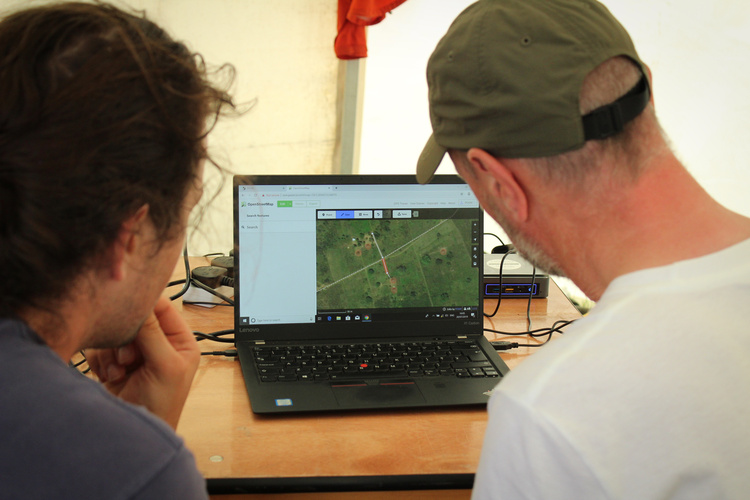
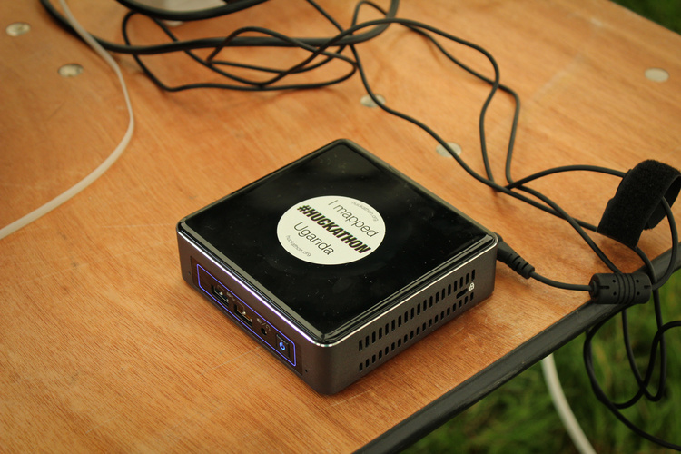
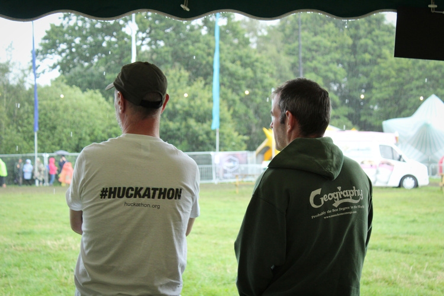

Following the success of last year the ***#Huckathon*** team were invited back, to a bigger and better tent for BlueDot Festival at Jodrell Bank this summer. There were two big differences between BlueDot 2018 and BlueDot 2019. First, it was unbelievably wet this year in comparison to the sweltering year before – I mean being from Manchester we are used to the rain but my goodness did it pour! Second, this year we weren’t on the Wi-Fi. We could have been, but we didn’t need it… 

Using a bit of techy know-how, Jonny built a few offline Portable Open Street Maps also known as POSMs. These are essentially little black boxes, pre-loaded with a series of tiles to be edited using Open Street Map (OSM). These can then be used in the same way as you would the online site, and saved back to the POSM. Not only did this mean that when the rotten weather cut the internet in other tents we were able to keep mapping huts and roads, but also that they can be used out in Uganda where internet access is limited. Hoorah!

There were a lot of similarities between the years too, and great ones at that. It was fantastic to see so many familiar faces returning for the second year in a row to come back and contribute more time (including our star mappers Joplin and Eden). We got thousands of huts and roads mapped, met lots of people interested in running their own ***#Huckathons*** and countless more curious to find out where the project is going. Whilst a number of the volunteer team from last year returned to guide people through the instructions and answer all your questions, we also had a generous helping of new volunteers who have got on board over the past year.

Of course, BlueDot isn’t all about the mapping, with headliners Hot Chip, Kraftwerk and New Order proving as phenomenal as you would expect and a great time being had by all. Despite persistent downpours for the first couple of days, by the end of the weekend the tents had dried out and the wellies were off – even better! We definitely learnt a few lessons for next year however, for example checking you’ve actually brought a sleeping bag *(Sam!)*, making sure your waterproofs are in fact waterproof *(Timna!!)* and ensuring that the laptop cases don’t let rain in *(Jonny!!!)*…

Big thank you to all the volunteers listed below who made this event possible and especially big thanks to The Unicorn Cooperative in Chorlton for providing organic fruit for all our hard working mappers to enjoy.

**Awesome volunteers:**

* Jonny Huck
* Timna Denwood
* John Moore
* Mad Hann
* Dellen Drake
* Sam Davies
* Esteban Arevalo
* Liz Ackerley
* Pete Ryan
* Siobhan Corbett
* Alex Hamer