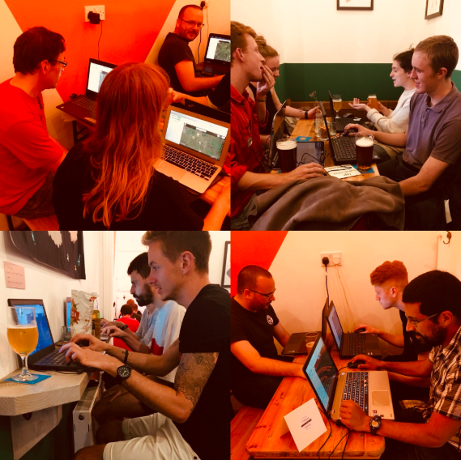

Just because it's the been summer holidays and most students disappear home or off on their travels doesn't mean the ***#Huckathon*** team slowed down. This summer saw the first series of #Huckathons at Station Hop, a craft beer tap house in Levenshulme (**[@stationhoplvm](https://twitter.com/stationhoplvm)**). Instead of doing a large scale one off event as has been done previously, a different approach was taken and fortnightly, small scale mapathons took place across July and August. Although the turnout was smaller (usually between 6-14 people), those who came stayed and mapped for the whole 2 hours of the event (and then some), resulting in thousands of features being added to the map - amazing!

In fact, since these events two of the generic  ***#Huckathon*** OSM accounts used have become responsible for a FIFTH of all map data in the Acholi region!! Additionally, it is becoming increasingly difficult to find totally unmapped areas too which really proves how much of an impact the ***#Huckathons*** have had so far. Not only has lots of data been added to the map but by being able to sit down, have a beer and chat with people while they map we now have two more events in the pipeline at workplaces in the city centre! So all round, ace little events in a top tap house that introduced a new audience to the project and produced invaluable data.

Big thanks to Amanda and the team at Station Hop and of course to all the volunteers to came and contributed their time to mapping huts and roads in Uganda!